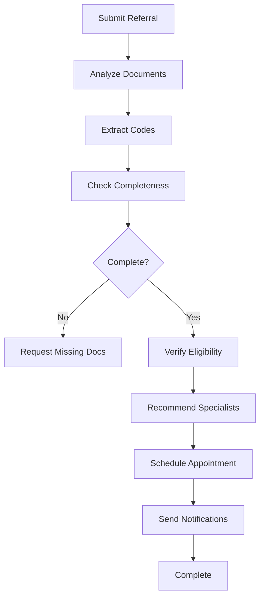

# Intelligent Care Coordination & Referral Management Platform


AI-powered referral management platform implementing 4 key AI opportunities with MCP (Model Context Protocol) integration for seamless healthcare coordination.

## Table of Contents

- [Features](#-features)
  - [Implemented AI Opportunities](#implemented-ai-opportunities)
  - [Core Capabilities](#core-capabilities)
- [Requirements](#-requirements)
- [Documentation](#-documentation)
- [Architecture](#️-architecture)
  - [Technology Stack](#technology-stack)
  - [Project Structure](#project-structure)
- [Quick Start](#-quick-start)
  - [Prerequisites](#prerequisites)
  - [Local Development Setup](#local-development-setup)
  - [Docker Deployment](#docker-deployment)
- [API Documentation](#-api-documentation)
  - [Core Endpoints](#core-endpoints)
- [Testing](#-testing)
  - [Run Unit Tests](#run-unit-tests)
  - [Run Integration Tests](#run-integration-tests)
  - [Run All Tests with Coverage](#run-all-tests-with-coverage)
  - [Manual API Testing](#manual-api-testing)
- [Configuration](#-configuration)
  - [Configuration Files](#configuration-files)
  - [Key Configuration Options](#key-configuration-options)
- [AI Opportunities Implementation](#-ai-opportunities-implementation)
- [Workflow](#-workflow)
- [Security & Compliance](#-security--compliance)
- [Development Notes](#-development-notes)
  - [For Deployment to Tekstac Virtual Machine](#for-deployment-to-tekstac-virtual-machine)
  - [External System Integration](#external-system-integration)
- [Support](#-support)
- [License](#-license)
- [Author](#-author)

## 🌟 Features

### Implemented AI Opportunities

1. **📄 Document Code Extraction**: Automatically extract ICD-10 diagnosis codes and CPT procedure codes from clinical documents using AI
2. **👨‍⚕️ Intelligent Specialist Recommendation**: AI-powered specialist matching based on diagnosis, location, insurance network, and availability
3. **💬 Conversational AI Assistant**: Answer patient queries through natural language interaction
4. **✅ Missing Document Detection**: Identify incomplete documentation before referral submission

### Core Capabilities

- ✨ End-to-end referral workflow automation
- 🔄 Multi-agent AI orchestration with LangGraph
- 🔌 MCP integration for AI agent coordination
- 🏥 Mock external system integrations (EHR, Payer, Scheduling)
- 📊 Real-time referral status tracking
- 🔐 Secure configuration management
- 🐳 Dockerized deployment

## 📋 Requirements

See [docs/project/requirements.md](docs/project/requirements.md) for complete project specifications.

## 📚 Documentation

All project documentation is organized by topic under [docs/](docs/README.md):

| Folder | Contents |
|--------|----------|
| [docs/project/](docs/project/README.md) | Requirements, project summary |
| [docs/architecture/](docs/architecture/README.md) | System architecture, design decisions, file structure |
| [docs/agents/](docs/agents/README.md) | AI agents, MCP usage, LangGraph orchestration |
| [docs/api/](docs/api/README.md) | API usage examples and test payloads |
| [docs/deployment/](docs/deployment/README.md) | Quick start guide, VM/Docker deployment |
| [docs/testing/](docs/testing/README.md) | Testing guide and procedures |
| [docs/demo/](docs/demo/README.md) | Live demo script and technical Q&A prep |

## 🏗️ Architecture

### Technology Stack

- **Backend**: FastAPI (Python 3.11)
- **AI Framework**: LangChain, LangGraph
- **MCP**: Model Context Protocol for agent integration
- **Database**: SQLite (development), PostgreSQL-ready
- **Deployment**: Docker, Docker Compose

### Project Structure

```
Capstone Assignment/
├── src/
│   ├── app.py                    # Main FastAPI application
│   ├── config.py                 # Configuration management
│   ├── models.py                 # Pydantic data models
│   ├── database.py               # Database models & manager
│   ├── agents/
│   │   └── referral_agent.py     # LangGraph AI agents
│   ├── mcp_servers/
│   │   ├── document_processor.py        # AI Opportunity #1 & #4
│   │   ├── specialist_recommender.py    # AI Opportunity #2
│   │   └── conversational_assistant.py  # AI Opportunity #6 & #3
│   └── services/
│       └── referral_service.py   # Business logic
├── tests/
│   ├── test_referral_service.py  # Unit tests
│   └── test_api.py               # Integration tests
├── docs/                         # All documentation, grouped by topic
│   ├── project/                  # requirements.md, PROJECT_SUMMARY.md
│   ├── architecture/             # ARCHITECTURE.md, FILE_STRUCTURE.md
│   ├── agents/                   # AGENTS.md, MCP_USAGE.md, LANGGRAPH_ORCHESTRATION.md
│   ├── api/                      # API_EXAMPLES.md, TEST_PAYLOADS.md
│   ├── deployment/               # QUICKSTART.md, DEPLOYMENT.md
│   ├── testing/                  # TESTING.md
│   └── demo/                     # DEMO_GUIDE.md, TECHNICAL_QA.md
├── config.yaml                   # Base configuration
├── config.local.yaml.example     # Local config template
├── .env.example                  # Environment variables template
├── requirements.txt              # Python dependencies
├── Dockerfile                    # Docker image definition
├── docker-compose.yml            # Docker Compose setup
└── README.md                     # This file
```

## 🚀 Quick Start

### Prerequisites

- Python 3.11+
- Docker & Docker Compose (for containerized deployment)
- API key for OpenAI or Anthropic (for AI features)

### Local Development Setup

1. **Clone/Copy the project**

```bash
cd "Capstone Assignment"
```

2. **Create virtual environment**

```bash
python -m venv venv
source venv/bin/activate  # On Windows: venv\Scripts\activate
```

3. **Install dependencies**

```bash
pip install -r requirements.txt
```

4. **Configure environment**

```bash
# Copy example configs
cp .env.example .env
cp config.local.yaml.example config.local.yaml

# Edit .env and add your API keys
nano .env  # or use any text editor
```

**Important**: Update `.env` with your actual API keys:
```env
OPENAI_API_KEY=your_actual_openai_key_here
# OR
ANTHROPIC_API_KEY=your_actual_anthropic_key_here
```

5. **Run the application**

```bash
python -m uvicorn src.app:app --reload --host 0.0.0.0 --port 8000
```

6. **Access the application**

- API: http://localhost:8000
- Interactive Docs: http://localhost:8000/docs
- Health Check: http://localhost:8000/health

### Docker Deployment

1. **Build the Docker image**

```bash
chmod +x build.sh
./build.sh
```

Or manually:
```bash
docker build -t referral-management-platform:latest .
```

2. **Configure for deployment**

Create `config.local.yaml` with your settings:
```yaml
ai:
  llm_model: "gpt-4"
  api_key: "YOUR_API_KEY_HERE"
```

Or use environment variables in `.env` file.

3. **Run with Docker Compose**

```bash
chmod +x run.sh
./run.sh
```

Or manually:
```bash
docker-compose up -d
```

4. **Check status**

```bash
docker-compose logs -f
```

5. **Stop the container**

```bash
docker-compose down
```

## 📖 API Documentation

### Core Endpoints

#### Referrals

- `POST /api/v1/referrals` - Submit new referral
- `GET /api/v1/referrals/{referral_id}` - Get referral status

#### Eligibility

- `POST /api/v1/eligibility` - Verify insurance eligibility

#### Specialists (AI Opportunity #2)

- `POST /api/v1/specialists/search` - AI-powered specialist search and recommendation

#### Documents (AI Opportunities #1 & #4)

- `POST /api/v1/documents/upload` - Upload clinical document
- `POST /api/v1/documents/analyze` - Extract codes using AI
- `POST /api/v1/documents/check-completeness` - Check for missing documents

#### Conversation (AI Opportunity #6)

- `POST /api/v1/conversation` - Conversational AI assistant

#### Patient History (AI Opportunity #3)

- `GET /api/v1/patients/{patient_id}/history` - Get AI-summarized referral history

#### Appointments

- `POST /api/v1/appointments` - Schedule appointment

#### Demo

- `POST /api/v1/demo/process-referral` - Complete workflow demonstration

## 🧪 Testing

### Run Unit Tests

```bash
pytest tests/test_referral_service.py -v
```

### Run Integration Tests

```bash
pytest tests/test_api.py -v
```

### Run All Tests with Coverage

```bash
pytest --cov=src --cov-report=html
```

### Manual API Testing

Use the interactive docs at http://localhost:8000/docs or use curl:

```bash
# Health check
curl http://localhost:8000/health

# Submit referral
curl -X POST http://localhost:8000/api/v1/referrals \
  -H "Content-Type: application/json" \
  -d '{
    "patient": {
      "patient_id": "PT001",
      "first_name": "John",
      "last_name": "Doe",
      "date_of_birth": "1980-01-01",
      "insurance_id": "INS001",
      "insurance_provider": "Blue Cross"
    },
    "referring_provider_id": "DR001",
    "specialty_requested": "Cardiology",
    "diagnosis_codes": ["I10"],
    "clinical_summary": "Patient with hypertension",
    "priority": "routine"
  }'

# Demo complete workflow
curl -X POST http://localhost:8000/api/v1/demo/process-referral
```

## 🔧 Configuration

### Configuration Files

1. **config.yaml** - Base configuration (committed to git)
2. **config.local.yaml** - Local overrides (gitignored, create from example)
3. **.env** - Environment variables (gitignored, create from example)

### Key Configuration Options

```yaml
ai:
  llm_model: "gpt-4"  # or "claude-3-sonnet-20240229"
  temperature: 0.7
  max_tokens: 2000

external_systems:
  mock_mode: true  # Set false to use real external systems
```

## 🎯 AI Opportunities Implementation

### 1. Document Code Extraction
**MCP Server**: `document_processor.py`
- Extracts ICD-10 diagnosis codes
- Extracts CPT procedure codes
- Confidence scoring
- **Endpoint**: `POST /api/v1/documents/analyze`

### 2. Specialist Recommendation
**MCP Server**: `specialist_recommender.py`
- AI-powered matching algorithm
- Considers: specialty, insurance, location, availability, ratings
- Returns ranked recommendations with reasoning
- **Endpoint**: `POST /api/v1/specialists/search`

### 3. Referral History Summary
**MCP Server**: `conversational_assistant.py`
- Generates comprehensive patient history summaries
- Identifies patterns and risk factors
- Formatted for specialist review
- **Endpoint**: `GET /api/v1/patients/{patient_id}/history`

### 4. Missing Document Detection
**MCP Server**: `document_processor.py`
- Validates document completeness by specialty
- Lists required vs. present documents
- Calculates completeness score
- **Endpoint**: `POST /api/v1/documents/check-completeness`

## 📊 Workflow



## 🔐 Security & Compliance

- ✅ Secrets managed via environment variables
- ✅ Configuration files gitignored
- ✅ Audit logging for critical operations
- ✅ HIPAA-compliant data handling patterns
- ✅ API key protection

## 📝 Development Notes

### For Deployment to Tekstac Virtual Machine

1. Copy entire project folder to VM
2. Ensure `.env` has correct API keys for the deployment environment
3. Update `config.local.yaml` if needed
4. Build and run with Docker:
   ```bash
   ./build.sh
   ./run.sh
   ```

### External System Integration

Current implementation uses mock mode. To integrate real systems:

1. Set `external_systems.mock_mode: false` in config
2. Implement actual API clients in `services/`
3. Update MCP servers to call real endpoints

## 🤝 Support

For issues or questions during evaluation, please check:

1. Application logs: `logs/application.log`
2. Docker logs: `docker-compose logs`
3. API docs: http://localhost:8000/docs

## 📄 License

Capstone Project for FDE Program - Educational Use

## 👨‍💻 Author

FDE Program Participant
Training Platform: wplearning.Tekstac.com

---

**Note**: This is a complete, production-ready implementation demonstrating all required AI opportunities, MCP integration, multi-agent workflows, and Docker deployment for the Capstone Assignment.
