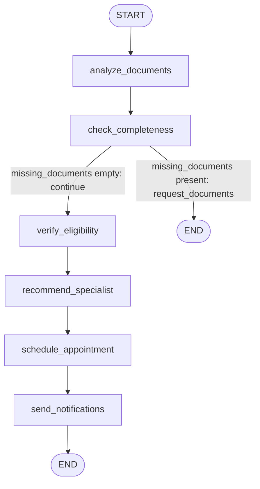

# LangGraph Orchestration

This document explains the multi-agent workflow implemented with LangGraph
in [src/agents/referral_agent.py](../../src/agents/referral_agent.py): the state
schema, the graph topology, conditional routing, and how to explain/extend
it during a technical review.

## Table of Contents

- [Why LangGraph](#why-langgraph)
- [State Schema](#state-schema--referralstate)
- [Graph Topology](#graph-topology)
  - [Node Responsibilities](#node-responsibilities)
  - [Conditional Edge](#conditional-edge)
- [Building & Compiling the Graph](#building--compiling-the-graph)
- [Execution Entry Point](#execution-entry-point)
- [Extending the Graph (Discussion Points)](#extending-the-graph-discussion-points)
- [Demo Script](#demo-script)

## Why LangGraph

LangGraph models an agentic workflow as a **graph of nodes** operating over
a **shared, typed state**, with edges (including conditional edges) defining
control flow. Compared to a hand-rolled loop or a pure ReAct agent, this
gives us:

- A visualizable, explicit process (important for a healthcare workflow
  that may need auditing/compliance review).
- Deterministic sequencing where it matters (documents → eligibility →
  specialist → scheduling → notification) while still allowing conditional
  branches (e.g., stop early if documents are missing).
- A single state object (`ReferralState`) threaded through every step,
  eliminating hidden shared mutable state.

## State Schema — `ReferralState`

```python
class ReferralState(TypedDict):
    referral_id: str
    patient_id: str
    messages: Sequence[BaseMessage]
    documents: List[Dict]
    diagnosis_codes: List[Dict]
    procedure_codes: List[Dict]
    missing_documents: List[str]
    eligibility_status: Dict
    recommended_specialists: List[Dict]
    selected_specialist: Dict
    appointment: Dict
    current_step: str
    errors: List[str]
    completed_steps: List[str]
```

Every node reads whatever fields it needs from this dict and returns the
(mutated) dict — this is the LangGraph convention for state reducers when no
custom reducer function is specified (last-write-wins per key).

## Graph Topology



### Node Responsibilities

| Node | Reads | Writes | External Call (conceptually) |
|------|-------|--------|-------------------------------|
| `analyze_documents` | `documents` | `diagnosis_codes`, `procedure_codes`, `completed_steps`, `messages` | MCP `extract_medical_codes` (AI #1) |
| `check_completeness` | `documents` | `missing_documents`, `completed_steps`, `messages` | MCP `check_document_completeness` (AI #4) |
| `verify_eligibility` | `referral_id` | `eligibility_status`, `completed_steps`, `messages` | Mock payer system |
| `recommend_specialist` | `diagnosis_codes` | `recommended_specialists`, `selected_specialist`, `completed_steps`, `messages` | MCP `recommend_specialists` (AI #2) |
| `schedule_appointment` | `selected_specialist` | `appointment`, `completed_steps`, `messages` | Mock scheduling system |
| `send_notifications` | `appointment` | `completed_steps`, `current_step`, `messages` | Mock notification system |

### Conditional Edge

```python
workflow.add_conditional_edges(
    "check_completeness",
    self.should_continue_after_docs,
    {
        "continue": "verify_eligibility",
        "request_documents": END
    }
)
```

`should_continue_after_docs` is a **routing function**: it inspects state
and returns a string key, which LangGraph maps to the next node (or `END`).
This is the only branch point in the current graph — everything else is a
straight edge (`workflow.add_edge(a, b)`).

## Building & Compiling the Graph

```python
workflow = StateGraph(ReferralState)
workflow.add_node("analyze_documents", self.analyze_documents)
...
workflow.set_entry_point("analyze_documents")
workflow.add_edge("analyze_documents", "check_completeness")
workflow.add_conditional_edges("check_completeness", self.should_continue_after_docs, {...})
workflow.add_edge("verify_eligibility", "recommend_specialist")
workflow.add_edge("recommend_specialist", "schedule_appointment")
workflow.add_edge("schedule_appointment", "send_notifications")
workflow.add_edge("send_notifications", END)
compiled = workflow.compile()
```

`workflow.compile()` returns a runnable graph (`self.workflow`) which is
invoked via `await self.workflow.ainvoke(initial_state)` inside
`process_referral(...)`.

## Execution Entry Point

```python
async def process_referral(self, initial_state: Dict) -> ReferralState:
    state: ReferralState = { ...seed fields... , "completed_steps": [] }
    result = await self.workflow.ainvoke(state)
    return result
```

The returned `result` is the fully populated final state — the caller (API
layer / background task) can inspect `completed_steps`, `messages`,
`appointment`, etc. to know exactly what happened and why.

## Extending the Graph (Discussion Points)

Likely follow-up questions in a review and how to answer them:

- **"How would you add a human-in-the-loop approval step?"** — add a new
  node (e.g., `await_manual_review`) and a conditional edge after
  `recommend_specialist` that routes to it when confidence/urgency
  thresholds are met; LangGraph supports interrupting/resuming graphs for
  this exact use case (`interrupt_before`/checkpointing).
- **"How would you handle retries/errors?"** — the `errors: List[str]`
  field already exists in the state for this; a node can append to it and a
  conditional edge can route to a `handle_error` node instead of the happy
  path.
- **"How would you parallelize independent steps?"** — e.g., eligibility
  verification and specialist recommendation don't strictly depend on each
  other; LangGraph supports fan-out/fan-in by adding edges from a single
  node to multiple nodes and merging state afterward.
- **"Why not a pure ReAct loop where the LLM picks the next tool freely?"**
  — for a regulated workflow, explicit graph edges give predictable,
  auditable behavior; the LLM/tools are still used for judgment *within*
  a step (e.g., ranking specialists) but not for deciding *which* business
  step runs next.
- **"How does this relate to the MCP servers?"** — nodes are orchestration
  only; the actual work (code extraction, specialist ranking, etc.) is
  delegated to MCP tools, keeping the graph itself thin and testable. See
  [MCP_USAGE.md](MCP_USAGE.md) and [AGENTS.md](AGENTS.md).

## Demo Script

1. Show the `ReferralState` `TypedDict` and explain each field's purpose.
2. Walk through `_build_workflow()` line by line, pointing at the
   mermaid diagram above as you go.
3. Run `process_referral(...)` twice: once with 3+ documents (happy path,
   full graph traversal) and once with < 3 documents (early exit via
   `should_continue_after_docs`).
4. Print `result["completed_steps"]` and `result["messages"]` after each run
   to show the graph took a different path and recorded it transparently.
