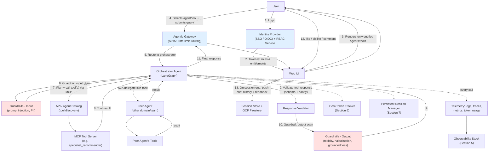
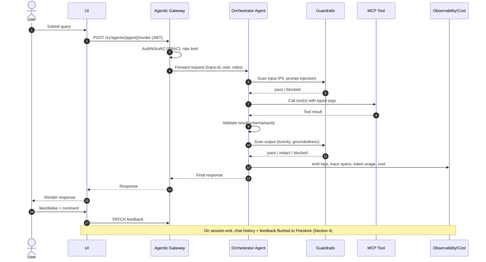
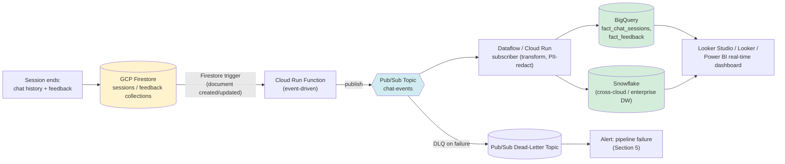
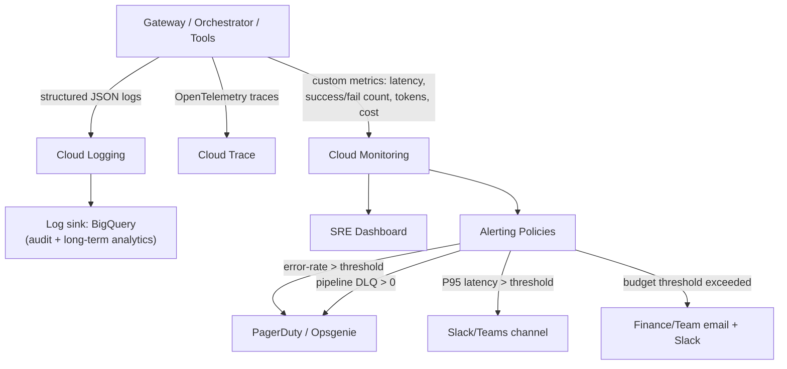
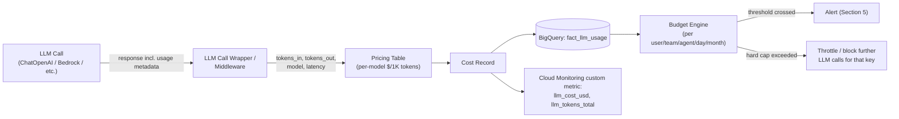
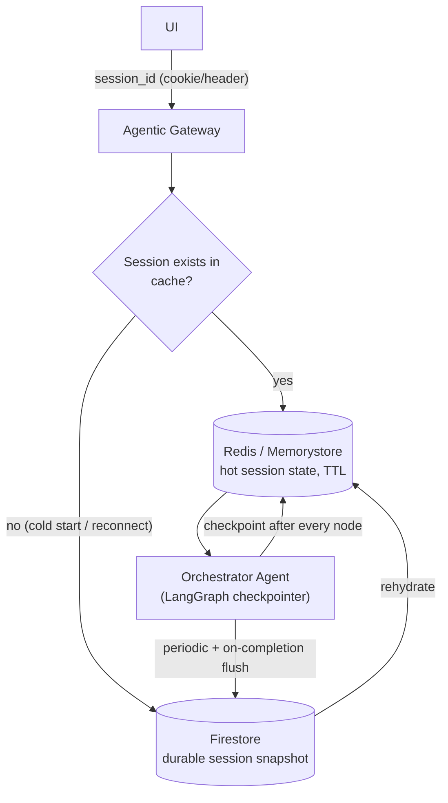
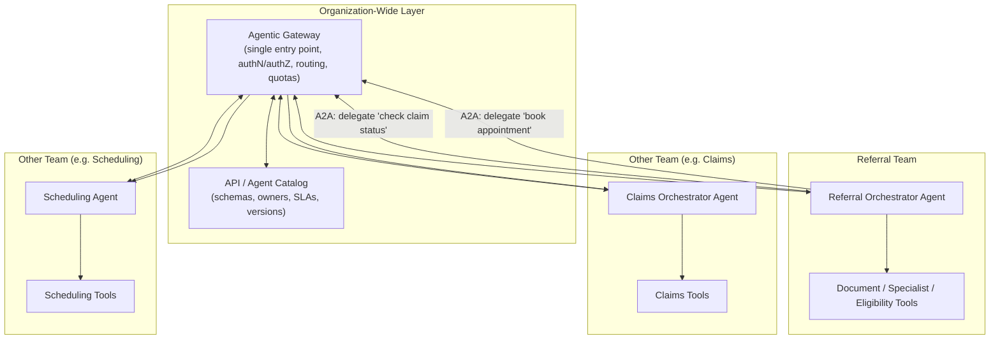

# Future-State Agentic Platform Architecture

A forward-looking target architecture for evolving this project from a single-agent
LangGraph/MCP demo into a production-grade, multi-agent, enterprise-reusable
platform with real-time analytics, cost governance, guardrails, and org-wide
tool/agent reuse via A2A and an Agentic Gateway.

> This document describes a **proposed future state**, not the current
> implementation. See [ARCHITECTURE.md](ARCHITECTURE.md) for the as-built
> architecture of the code in this repo today.

## Table of Contents

- [1. Functional Requirements](#1-functional-requirements)
- [2. Non-Functional Requirements](#2-non-functional-requirements)
- [3. End-to-End Architecture](#3-end-to-end-architecture)
  - [3.1 High-Level Flow](#31-high-level-flow)
  - [3.2 Component Responsibilities](#32-component-responsibilities)
  - [3.3 Request Sequence](#33-request-sequence)
- [4. Real-Time Streaming & Reporting Pipeline](#4-real-time-streaming--reporting-pipeline)
- [5. Observability: Logging, Metrics & Alerting](#5-observability-logging-metrics--alerting)
- [6. Cost Tracking & LLM Token Usage](#6-cost-tracking--llm-token-usage)
- [7. Persistent Session Management](#7-persistent-session-management)
- [8. Guardrails](#8-guardrails)
- [9. A2A, Agentic Gateway & API Catalog](#9-a2a-agentic-gateway--api-catalog)
- [10. Security & Vulnerability Management](#10-security--vulnerability-management)
- [11. Data Model Additions](#11-data-model-additions)
- [12. Phased Rollout Plan](#12-phased-rollout-plan)

---

## 1. Functional Requirements

| ID | Requirement |
|----|-------------|
| FR-1 | Users must authenticate (SSO/OIDC) before accessing the platform; every action is authorized via Role-Based Access Control (RBAC). |
| FR-2 | The UI must only show agents/tools the authenticated user's role is entitled to use. |
| FR-3 | Users can select an orchestrator agent (or let the platform auto-route) to handle a natural-language query. |
| FR-4 | The orchestrator agent must be able to call one or more registered tools (via MCP) to satisfy the request. |
| FR-5 | Tool responses must be validated by the agent (schema + sanity checks) before being returned to the user. |
| FR-6 | Users can rate a response (like/dislike) and leave free-text comments per turn. |
| FR-7 | On session completion, full chat history + feedback must be persisted for reporting. |
| FR-8 | Persisted conversation/feedback data must stream into a real-time analytics pipeline and be visible on a dashboard within seconds of write. |
| FR-9 | All agent/tool invocations, successes, failures, and latencies must be logged and alertable. |
| FR-10 | Every LLM call's token usage and estimated cost must be tracked, attributable to user/team/agent. |
| FR-11 | A user's conversation session must survive UI reloads / reconnects (persistent session state). |
| FR-12 | Agent responses must pass configurable guardrails (PII leakage, toxicity, hallucination/groundedness, prompt-injection detection) before reaching the user. |
| FR-13 | Agents must be able to delegate sub-tasks to other agents (agent-to-agent, A2A) across teams/domains. |
| FR-14 | All tools/agents must be discoverable and reusable across the organization via a central API/Agent Catalog behind a single Agentic Gateway. |

## 2. Non-Functional Requirements

| Category | Requirement |
|----------|-------------|
| **Performance** | P95 end-to-end response latency < 3s for tool-augmented queries; < 800ms for cached/simple queries. |
| **Scalability** | Stateless orchestrator/gateway tiers must horizontally autoscale to 10x baseline traffic with no code change. |
| **Availability** | 99.9% uptime for the Agentic Gateway and orchestration tier; graceful degradation (fallback to non-AI paths) on LLM provider outage. |
| **Reliability** | At-least-once delivery for feedback/chat-history events into the streaming pipeline; no silent data loss. |
| **Observability** | 100% of requests traced end-to-end (trace ID propagated from UI → gateway → agent → tool → LLM). |
| **Security** | All the OWASP Top 10 (2021) categories addressed; see [Section 10](#10-security--vulnerability-management). |
| **Cost Governance** | Real-time token/cost visibility per user/team/agent; automatic alert + optional throttling when budget thresholds are crossed. |
| **Compliance** | PII/PHI redaction in logs and analytics tables; full audit trail retained per data-retention policy (e.g., HIPAA-aligned, given this is a healthcare referral platform). |
| **Extensibility** | New agents/tools onboard to the catalog without modifying the gateway or orchestrator core. |
| **Data Freshness** | Dashboard data lag from event write to dashboard visibility: < 10 seconds (streaming), < 5 minutes for batch-reconciled tables. |

---

## 3. End-to-End Architecture

### 3.1 High-Level Flow



### 3.2 Component Responsibilities

| Component | Responsibility | Maps to today's code |
|-----------|-----------------|------------------------|
| **Identity Provider / RBAC** | Authenticates user (OIDC/SAML), issues token with role + entitlements claims. | Not yet implemented — see [Section 12](#12-phased-rollout-plan). |
| **Web UI** | Renders only the agents/tools the role is entitled to; collects query, renders response, captures like/dislike/comment. | New; future UI layer on top of the API. |
| **Agentic Gateway** | Single ingress for all agent/tool traffic: authn/authz enforcement, rate limiting, request routing, protocol translation (REST ⇄ MCP ⇄ A2A). | Extends [src/mcp_server.py](../../src/mcp_server.py) / [src/app.py](../../src/app.py). |
| **Orchestrator Agent** | Plans, calls tools, validates results, applies guardrails, returns response. | [ReferralAgent](../../src/agents/referral_agent.py) (LangGraph `StateGraph`). |
| **API / Agent Catalog** | Central registry of all tools/agents across the org (owner, schema, SLAs, versioning) for discovery & reuse. | New — see [Section 9](#9-a2a-agentic-gateway--api-catalog). |
| **MCP Tool Servers** | Domain-specific tools (document analysis, specialist search, eligibility, scheduling, etc.) exposed via MCP. | [src/mcp_servers/*](../../src/mcp_servers/). |
| **Peer Agents (A2A)** | Other teams' agents, callable via the Agent-to-Agent protocol for cross-domain tasks. | New — see [Section 9](#9-a2a-agentic-gateway--api-catalog). |
| **Guardrails** | Input/output safety checks: prompt injection, PII/PHI leakage, toxicity, hallucination/groundedness scoring. | New — see [Section 8](#8-guardrails). |
| **Session Store / Firestore** | Durable store for in-flight session state and completed chat history + feedback. | New — see [Section 7](#7-persistent-session-management). |
| **Telemetry / Observability** | Structured logs, distributed traces, metrics, dashboards, alerting. | New — see [Section 5](#5-observability-logging-metrics--alerting). |
| **Cost/Token Tracker** | Per-call token accounting and cost attribution. | New — see [Section 6](#6-cost-tracking--llm-token-usage). |

### 3.3 Request Sequence



---

## 4. Real-Time Streaming & Reporting Pipeline

Chat history and feedback are written to **GCP Firestore** as the system of record for
session data, then streamed into a warehouse for real-time dashboards.



**Flow explained:**
1. When a session completes, the UI/Gateway writes the final chat transcript + like/dislike/comment to **Firestore** (`sessions/{sessionId}` and `feedback/{feedbackId}`).
2. A **Cloud Run function** is configured with an **Eventarc trigger** on Firestore `document.create`/`document.write` — no polling, purely event-driven.
3. The function validates/enriches the event and **publishes** it to a **Pub/Sub topic** (`chat-events`), decoupling ingestion from processing.
4. A **Dataflow (Apache Beam) streaming job** or a **Pub/Sub-triggered Cloud Run subscriber** consumes the topic, applies PII/PHI redaction and schema normalization, and writes to:
   - **BigQuery** (`fact_chat_sessions`, `fact_feedback`, `fact_tool_calls`) for native GCP BI, or
   - **Snowflake** (via Snowpipe Streaming or a Snowflake Sink connector) if the org's central DW is Snowflake.
5. **Looker Studio / Looker / Power BI** dashboards query BigQuery/Snowflake directly (or via materialized/streaming views) for near-real-time reporting (session volume, satisfaction rate, top agents/tools, latency, cost).
6. Failed publishes/writes route to a **Pub/Sub Dead-Letter Topic**, which triggers an alert (never silently dropped).

---

## 5. Observability: Logging, Metrics & Alerting

Every request must be **logged, traced, and measured** for latency and success/failure, with alerts on threshold breaches.



**Logging standard** (structured, one JSON line per event):
```json
{
  "timestamp": "2026-08-12T10:15:30Z",
  "trace_id": "abc123",
  "session_id": "sess-9f2",
  "user_id": "u-4521",
  "agent": "referral_orchestrator",
  "tool": "specialist_recommender",
  "event": "tool_call",
  "status": "success",
  "latency_ms": 412,
  "tokens_in": 850,
  "tokens_out": 220,
  "estimated_cost_usd": 0.0034
}
```

**Alert policies** (examples, all configurable thresholds):

| Signal | Threshold (example) | Action |
|--------|----------------------|--------|
| Tool/agent call failure rate | > 5% over 5 min | Page on-call via PagerDuty |
| P95 end-to-end latency | > 3000 ms over 5 min | Slack alert to platform channel |
| Guardrail block rate | > 10% over 15 min (possible attack/abuse) | Security team alert |
| Streaming pipeline DLQ depth | > 0 messages | Page on-call |
| LLM provider error rate | > 2% over 5 min | Auto-failover to secondary model + alert |
| Daily token spend | > 80% of budget | Slack/email to team lead |
| Daily token spend | > 100% of budget | Alert + optional auto-throttle (Section 6) |

Every **success** is also logged (not just failures) so throughput, adoption, and trend
dashboards can be built from the same event stream used for alerting.

---

## 6. Cost Tracking & LLM Token Usage



**Implementation approach:**
- Wrap every LLM client call (e.g., `ChatOpenAI` in [referral_agent.py](../../src/agents/referral_agent.py)) in a middleware/decorator that reads the provider's `usage` metadata (`prompt_tokens`, `completion_tokens`, `total_tokens`) returned with each response.
- Maintain a **pricing table** (model → $ per 1K input/output tokens) as config, refreshed when providers change pricing.
- Emit one **cost record** per LLM call: `{user_id, team_id, agent, model, tokens_in, tokens_out, cost_usd, timestamp}` → stream to BigQuery (`fact_llm_usage`) via the same Pub/Sub pipeline as Section 4.
- Aggregate into **budgets** per user/team/agent/day/month; expose via dashboard and via an internal `/v1/cost/summary` API.
- **Threshold actions**: soft threshold (e.g. 80%) → alert only; hard threshold (100%+) → configurable to either just alert, or actively **throttle/block** further LLM calls for that identity until the next budget period (fail-safe, not fail-open, for cost control — but the guardrail should itself fail open for clinical-safety-critical flows with an override/approval path).

---

## 7. Persistent Session Management



- **Hot state** (active, in-progress session: partial LangGraph `ReferralState`, message history) lives in **Redis/Memorystore** with a TTL, keyed by `session_id`, so a UI reload or brief disconnect resumes exactly where it left off.
- **Durable state** is checkpointed to **Firestore** using LangGraph's checkpointer interface (e.g., a custom `Checkpointer` backed by Firestore, or `langgraph-checkpoint` with a GCP-compatible backend) so sessions survive orchestrator pod restarts, not just Redis TTL expiry.
- The gateway resolves `session_id` from a signed cookie/header, never trusts a client-supplied user identity without validating against the RBAC token.
- On explicit "end session" (or an idle timeout), final state + feedback is flushed to Firestore and the Section 4 streaming pipeline picks it up from there.

---

## 8. Guardrails

Two guardrail checkpoints per request — **before** the agent acts (input) and **before**
the response reaches the user (output) — as already shown in [Section 3.1](#31-high-level-flow).

| Guardrail | Applied to | Technique |
|-----------|-----------|-----------|
| Prompt-injection / jailbreak detection | Input | Pattern/classifier-based scanner (e.g., a dedicated small classifier model or rules engine) run before the query reaches the orchestrator's system prompt. |
| PII/PHI detection & redaction | Input & Output | Regex + NER-based PII/PHI detector (names, DOB, SSN, MRN, diagnosis codes) — redact or block based on policy, since this is a healthcare platform. |
| Toxicity / harmful content | Output | Lightweight moderation classifier on the final response before returning to user. |
| Hallucination / groundedness | Output | Compare response claims against the actual tool results used (e.g., citation/fact-check step); low-confidence responses are flagged or re-run with stricter instructions. |
| Schema/contract validation | Tool responses | Every MCP tool response validated against its declared JSON schema before the agent is allowed to reason over it (fail closed on mismatch). |
| Rate/volume abuse detection | Input | Gateway-level anomaly detection (sudden spike from one identity) feeding into the Section 5 alerting. |
| Human-in-the-loop escalation | Output | Low-confidence or guardrail-flagged responses can be routed to a human reviewer queue instead of auto-returned, for clinically sensitive flows. |

Guardrail outcomes are themselves logged (pass/redact/block + reason) so guardrail
effectiveness and false-positive rates can be monitored and tuned over time.

---

## 9. A2A, Agentic Gateway & API Catalog



- **Agentic Gateway**: the single ingress/egress point for *all* agent and tool traffic
  org-wide. Enforces authentication, RBAC, quotas/rate limits, and protocol
  translation, and is where the **A2A protocol** is implemented — one agent can
  discover and invoke another team's agent as if it were a tool, without needing
  direct network access or bespoke integration per pair of teams.
- **A2A (Agent-to-Agent)**: standardized request/response envelope (e.g., task
  description, structured input schema, callback/streaming support, auth context
  propagation) so any registered agent can delegate a sub-task to any other
  registered agent through the gateway, regardless of which team built it or
  which framework it uses internally (LangGraph, custom, etc.).
- **API / Agent Catalog**: a central, searchable registry (think an internal
  "marketplace") of every tool and agent available across the org — its input/output
  schema (MCP tool schema or OpenAPI), owning team, SLA, version history, and
  usage examples. New teams building agents **register** once and instantly
  become reusable/discoverable by every other agent through the gateway, instead
  of every team re-building similar tools (e.g., "specialist search",
  "eligibility check") independently.
- This turns the current single-repo MCP setup ([src/mcp_servers/*](../../src/mcp_servers/))
  into one *node* in an org-wide mesh of interoperable agents and tools.

---

## 10. Security & Vulnerability Management

Mapped against the **OWASP Top 10 (2021)** plus AI-specific risks (**OWASP Top 10 for LLM Applications**):

| Risk | Mitigation in this architecture |
|------|----------------------------------|
| **A01 Broken Access Control** | RBAC enforced at the Identity Provider *and* re-validated at the Agentic Gateway on every request (never trust the UI alone); tool/agent catalog entries carry required roles/scopes. |
| **A02 Cryptographic Failures** | TLS everywhere (UI↔Gateway↔Agents↔Tools); secrets (API keys, DB passwords) in GCP Secret Manager / Vault, never in code or config files (see existing `.env`/`config.local.yaml` gitignore pattern in [ARCHITECTURE.md](ARCHITECTURE.md#secrets-management)). |
| **A03 Injection** | Parameterized queries at the data layer; strict MCP tool input schema validation; **prompt-injection guardrail** (Section 8) specifically for LLM-directed injection. |
| **A04 Insecure Design** | Threat-modeled request flow (this doc), fail-closed guardrails and schema validation by default, human-in-the-loop escalation for high-risk actions. |
| **A05 Security Misconfiguration** | Infrastructure as Code (Terraform/Bicep) for all GCP resources, config drift detection, least-privilege IAM roles per Cloud Run/Function service account. |
| **A06 Vulnerable & Outdated Components** | Automated dependency scanning (e.g., Dependabot/Snyk) on [requirements.txt](../../requirements.txt); pinned versions; scheduled patch cadence. |
| **A07 Identification & Auth Failures** | OIDC/SSO with MFA at the Identity Provider; short-lived tokens; session fixation protection in the Persistent Session Manager (Section 7). |
| **A08 Software & Data Integrity Failures** | Signed container images, verified MCP tool registrations in the Catalog (no arbitrary/unregistered tool execution), checksum-verified deployment artifacts. |
| **A09 Security Logging & Monitoring Failures** | Section 5's full logging/tracing/alerting stack — every auth failure, guardrail block, and tool error is logged and alertable, addressing this category directly. |
| **A10 Server-Side Request Forgery (SSRF)** | Tool/agent outbound calls restricted to an allow-list of registered endpoints from the Catalog; no agent can be instructed to call an arbitrary URL. |
| **LLM01 Prompt Injection** | Input guardrail scanner + system-prompt hardening + tool-call allow-listing (agent can only invoke catalog-registered tools, not arbitrary code/URLs). |
| **LLM02 Insecure Output Handling** | Output guardrail (toxicity/PII/groundedness) before any response is rendered or used to trigger a downstream action. |
| **LLM06 Sensitive Information Disclosure** | PII/PHI redaction in both guardrails and the streaming/analytics pipeline (Section 4) before data lands in BigQuery/Snowflake. |
| **LLM10 Model Theft / Unbounded Consumption** | Cost/token budget engine (Section 6) with throttling; rate limiting at the Gateway. |

**Additional practices:**
- Regular **penetration testing** and **red-teaming** of the guardrails (adversarial prompt testing).
- **Data residency & retention policy** enforced in BigQuery/Snowflake (esp. for PHI given this is a healthcare referral platform — align with HIPAA).
- **Least-privilege service accounts** per Cloud Run function/service, scoped IAM bindings, no shared "god" credentials.
- **Audit trail immutability**: audit logs (`audit_logs` table, extended per Section 11) written to an append-only sink in addition to the queryable table.

---

## 11. Data Model Additions

New tables/collections needed beyond the current [`database.py`](../../src/database.py) schema (`referrals`, `patients`, `providers`, `documents`, `appointments`, `audit_logs`):

| Store | Table/Collection | Purpose |
|-------|-------------------|---------|
| Firestore | `sessions/{sessionId}` | Live + completed chat session transcripts. |
| Firestore | `feedback/{feedbackId}` | Per-turn like/dislike + comments, linked to `sessionId`. |
| BigQuery/Snowflake | `fact_chat_sessions` | Streamed, analytics-ready session records. |
| BigQuery/Snowflake | `fact_feedback` | Streamed feedback records for satisfaction dashboards. |
| BigQuery/Snowflake | `fact_tool_calls` | Every tool/agent invocation: latency, status, args (redacted). |
| BigQuery/Snowflake | `fact_llm_usage` | Token usage + cost per LLM call (Section 6). |
| Redis/Memorystore | `session:{sessionId}` | Hot, TTL'd in-flight session/agent state. |
| Postgres/Cloud SQL | `agent_catalog`, `tool_catalog` | Org-wide registry (Section 9): owner, schema, version, SLA. |

## 12. Phased Rollout Plan

| Phase | Scope |
|-------|-------|
| **Phase 0 (today)** | Single agent ([ReferralAgent](../../src/agents/referral_agent.py)), single-repo MCP tools, SQLite/MySQL persistence — as documented in [ARCHITECTURE.md](ARCHITECTURE.md). |
| **Phase 1** | Add Identity Provider + RBAC, structured logging/tracing (Section 5), basic input/output guardrails (Section 8). |
| **Phase 2** | Introduce persistent session management (Redis + Firestore, Section 7) and feedback capture in the UI. |
| **Phase 3** | Build the real-time streaming pipeline (Firestore → Cloud Run → Pub/Sub → BigQuery/Snowflake → dashboard, Section 4) and cost/token tracking (Section 6). |
| **Phase 4** | Stand up the Agentic Gateway + API/Agent Catalog; onboard the existing MCP tools as the first catalog entries. |
| **Phase 5** | Implement A2A so this agent can delegate to (and receive delegations from) other teams' agents through the gateway. |
| **Phase 6** | Org-wide rollout: additional teams register their own agents/tools in the catalog, reusing the same gateway, guardrails, observability, and cost-governance stack. |
